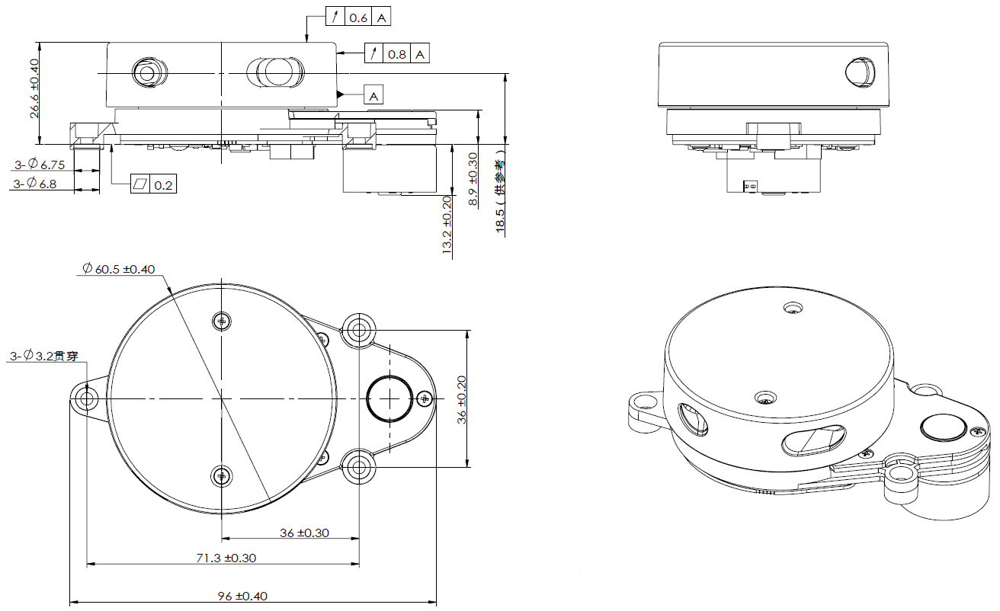
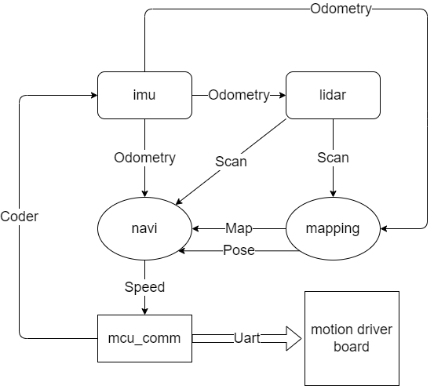

# SmartLidar
SmartLidar 是集成了激光雷达传感器和算法控制板的一体化智能传感器。
算法控制板中内置了一些实用的建图导航算法，可供用户直接使用。
用户也可以将自己开发的算法代码移植到内置的算法控制板上。
集成化的设计能够有效的降低系统复杂度，减小安装体积，降低成本和增强稳定性。
## 硬件说明
### 1. 外观结构图

### 2. 接口图

## 快速使用
### 1. 硬件连接
* 使用随机附赠的 USB to micro 连接线，将 SmartLidar 连接到电脑的 USB 口，参考下述的 [2. 使用 ssh 登录](#2-使用-ssh-登录) 和 [3. 使用 adb 登录](#3-使用-adb-登录) 即可开始测试 SmartLidar 的功能。
* 参考[接口图](#2-接口图)将 SmartLidar 与你的运动控制驱动板连接，即可开始使用 SmartLidar.

### 2. 使用 ssh 登录
雷达上电后会默认发射名为 "SmartLidar_XXXXXX" WiFi 热点，用户可以使用电脑连接该热点，打开终端输入
```
ssh root@192.168.4.1
```
远程登录到 SmartLidar 中的 Linux 系统，密码默认为 XDROBOT

登录到系统后，可使用以下命令将 SmartLidar 连接到 WiFi 路由器上，这样 PC 可以在同一个局域网中使用 ssh 登录到 SmartLidar
```
wifi_connect_ap_test "SSID" "password"
```
SSID 和 password 替换为你的无线路由器的 ssid 和密码，目前 Smart Lidar 仅支持 2.4GHz 的无线网络

使用如下命令记录下雷达的 ip 地址
```
ifconfig
```
后续在同一个局域网下，可使用
```
ssh root@xxx.xxx.xxx.xxx
```
来登录 SmartLidar
### 3. 使用 adb 登录
使用随机附赠的 USB to micro 连接线将 PC 连接到 SmartLidar 上的 micro USB 连接口，打开终端输入
```
adb shell
```
可使用 adb 登录到 SmartLidar 中的 Linux 系统
登录后可使用 wifi_connect_ap_test 来连接路由器
### 4. 开启雷达
登录到系统后进入目录
 ```
 cd /root/r329
 ```
 配置运行环境，重新登录 ssh 或 adb shell 后，执行程序前均需要执行配置环境指令
 ```
 source ./runon329.sh   
 ```
 开启雷达
 ```
 ./sendevt Power LPWR 1
 ``` 
 将会开启雷达，SmartLidar 默认配置为无需里程计可直接手持雷达建图。开启雷达后，打开 rviz 应当可以看到地图显示。
 手持雷达移动建图时，应当尽量保持平稳，避免行走速度过快，或角速度过快;保持雷达水平，避免水平倾角发生太大的变化。

如果已经完成底盘控制的对接，可以使用里程计信息建图，将有更好的建图效果。
进入配置目录
```
cd /root/r329/configuration_files
```
备份当前配置文件
```
mv mapping.lua mapping_noodom.lua
```
使用 odom 配置文件
```
mv mapping_odom.lua mapping.lua
```
重启或重新上电
```
reboot
```


### 5. 软件环境安装
#### 5.1 安装在 Ubuntu 上
##### 1. 安装 Ubuntu
建议使用 Ubuntu 20.04 或更新版本，将 Ubuntu 系统安装到电脑或虚拟机中，具体安装方法可参考网络教程
###### 2. 安装 ROS noetic 版本
安装教程参考 https://wiki.ros.org/cn/noetic/Installation/Ubuntu
建议安装完整版
```
sudo apt install ros-noetic-desktop-full
```
若安装速度缓慢，可参考网络教程更改软件源

##### 3. 安装 git
```
sudo apt install git
```
##### 4. 创建文件夹并使用 git 克隆本工程
从 github 克隆
```
https://github.com/grtstar/smart_lidar.git
```
若无法访问 github 可从 gitee 克隆
```
```
#### 5.2 使用 dock 安装
敬请期待

#### 5.3 编译工程
在 pc 上打开终端，进入 smart_lidar 文件夹，输入
```
source rosenv.sh
cd rosws
catkin_make
```

### 6. 使用 rviz 查看地图，并控制导航
在 pc 上打开终端，进入 smart_lidar 文件夹，输入
```
source rosenv.sh
```
进入 rosws 文件夹输入
```
cd rosws
./lidarcar xxx.xxx.xxx.xxx
```
xxx.xxx.xxx.xxx 为 SmartLidar 的 ip 地址

使用 rviz 中的 2D Navi Goal 功能，点击地图上的点，可显示规划路径。如果轮组驱动已经正确对接，SmartLidar 将会发送实时速度，控制机器人导航到目标点。

### 7. SmartLidar 参数配置
1. [雷达参数配置](./config/lidar/eai.json)
* 雷达位置 sensorPose
* 雷达零位角
2. [机器参数配置](./config/robot.json)
* 机器半径  radius
* 最大线速度    vmax
* 最大线加速度  vamax
* 最大角速度    wmax
* 最大角加速度  wamax
* 运动学模型 kine_model
3. [传感器参数配置](./config/sensor.json)
```
{
    "TopicName":"SCAN",         // 传感器主题名称
    "sensorSource":0,           // 传感器序号,从 0 开始
    "sensorType":"SENSOR_POINTCLOUD2",  // 传感器数据类型 SENSOR_POINTCLOUD2, 表示点云类型
    "obsType":["OBS_EDGE"],             // 传感器功能类型
    "sensorPose":{"sensorX":0.0, "sensorY":0, "sensorZ":0.10, "sensorRoll":0, "sensorPicth":0, "sensorYaw":0}   //传感器安装位置,相对于机器人几何中心
}
```
目前支持的传感器类型为
```
enum SensorType
{
    SENSOR_SCAN,            // 弃用
    SENSOR_POINTCLOUD,      // 弃用
    SENSOR_POINTCLOUD2,     // 点云类型传感器,如激光雷达
    SENSOR_IMU,             // IMU,内置传感器无需配置
    SENSOR_CODER,           // 无需配置
    SENSOR_BUMPER,          // 碰撞传感器
    SENSOR_FLOOR,           // 暂未使用
    SENSOR_ODOM,            // 里程计参考默认配置即可
    SENSOR_REALODOM,        // 里程计参考默认配置即可
    SENSOR_RANGE,           // 单点测距传感器,可使用点云类型传感器代替
    SENSOR_POSE,            // 暂未使用
    SENSOR_INTENSITY,       // 暂未使用
};

```
传感器配置用于自带的导航避障算法，如果不使用自带导航避障算法，则可以不配置传感器

如果选择使用里程计辅助建图，则需要提供轮组编码器或者里程计数据给到 SmartLidar, 其中编码器数据的主题名称为 WCODE，里程计主题名称为 REALODOM

### 8. 轮组驱动
当使用 SmartLidar 内置的自动建图或者点对点导航等功能时，SmartLidar 会输出实时线速度和角速度。用户的运动控制板需要接收这个线速度和角速度，并转换为轮组速度，具体操作请参考下文中的 lcm 通讯部分。


## 软件架构

### 软件框图

### 通讯框架
#### 1. lcm
SmartLidar 内部并没有使用 ros，而是使用 lcm2 来处理进程间的通讯。用户自己的程序如果需要和内置算法进行交互时，均需要通过 lcm2 的消息来进行互相通讯。
#### 2. lcm 消息
##### 2.1 预置消息
我们预置了一些 lcm 消息，大部分可以与 ros 消息对应，请参考 message 文件夹，其中一些例子如下
* [mars_message::GridMap](./common/arm/include/mars_message/GridMap.hpp) <--> [ros::nav_msgs/OccupancyGrid](https://docs.ros.org/en/lunar/api/nav_msgs/html/msg/OccupancyGrid.html)
* [mars_message::Point](./common/arm/include/mars_message/Point.hpp) <--> [ros::geometry_msgs/Point](https://docs.ros.org/en/lunar/api/geometry_msgs/html/msg/Point.html)
* [mars_message::Pose](./common/arm/include/mars_message/Pose.hpp) <--> [ros::geometry_msgs/Pose](https://docs.ros.org/en/lunar/api/geometry_msgs/html/msg/Pose.html)
* [mars_message::Path](./common/arm/include/mars_message/Path.hpp) <--> [ros::nav_msgs/Path](https://docs.ros.org/en/lunar/api/nav_msgs/html/msg/Path.html)
* [mars_message::Odometry](./common/arm/include/mars_message/Odometry.hpp) <--> [ros::nav_msgs/Odometry](https://docs.ros.org/en/lunar/api/nav_msgs/html/msg/Odometry.html)

#### 3. lcm_tunnel
由于 lcm 使用的 udp 消息，在无线局域网环境中会发生比较明显的丢包，为了方便调试，SmartLidar 通过 lcm_tunnel 将 udp 消息通过 tcp 转发到局域网中的 PC 机上。

#### 4. lcm to ROS
lcm2ros 和 ros2lcm 包用于 lcm 和 ros 消息的互相转换。

#### 5. 对 lcm 的扩展
lcm2 扩展了 lcm 的功能，对于消息发送除了 publish 接口外，还增加了 send 接口，send 接口可以获取返回值，可实现类似远程调用或 ros service 的效果。具体使用方法可以参考[例程]()

#### 6. 与 MCU(下位机) 的通讯
SmartLidar 并不包含运动执行器的功能，一般来说需要通过下位机来实现轮组控制和一些传感器的采集.SmartLidar 和下位机通过 Uart 串口通信。串口数据同样以 lcm 格式打包。为了避免 mcu 消息过载，mcu_comm 程序将把必要的消息 (通过主题过滤) 传送到 mcu，而将 mcu 所有上发的消息转换为 lcm 消息发送到 SmartLidar 系统中。

### 算法接口
* 开启雷达
 ```
 ./sendevt Power LPWR 1
 ``` 
* 关闭雷达
 ```
 ./sendevt Power LPWR 0
 ``` 
* 自动建图
* 获取地图
* 获取位姿
* 获取规划路径
* 开始点对点导航


### 开发环境
#### 在 SmartLidar 上开发自己的程序
SmartLidar 使用 CMake 构建系统，用户需要编写 CMakeLists.txt 来构建自己的程序。
1. 下载 toolchain 并放置于 smart_lidar 的同级目录下
2. 初始化环境
```
    source common/env_arm.sh
``` 
3. 创建代码文件夹，并编写代码和 CMakeLists.txt
```
    cd your_source_dir
    mkdir build
    cd build
    cmaker
    make
```
4. 将编译好的程序，通过 scp 或者 adb push 传送到雷达上运行

### 模拟仿真

### 例程介绍